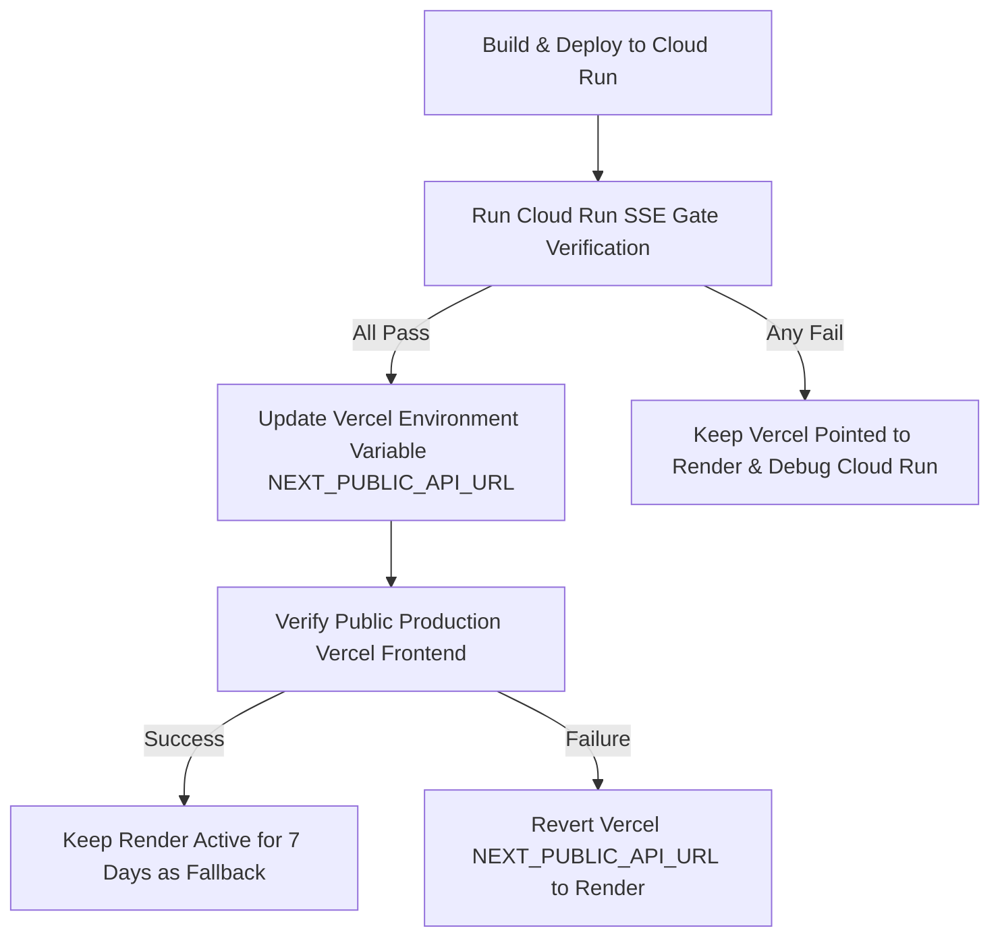

# SwarmOps Cloud Run Deployment Checklist & SSE Gate

This document serves as the official readiness checklist, deployment playbook, and verification gate for migrating the SwarmOps FastAPI backend to Google Cloud Run.

---

## 1. Required Runtime Settings

Configure these settings during deployment (either in the Google Cloud Console or via the `gcloud run deploy` command-line flags):

* **Region**: `us-central1` (or another low-cost region close to your Supabase/OpenRouter endpoints).
* **Authentication Mode**: **Allow unauthenticated invocations**. The Vercel public frontend will request this backend directly from client browsers.
* **Ingress Setting**: **All** (to allow traffic from any origin on the internet, required by Vercel client browsers).
* **Memory Recommendation**: `512Mi` or `1Gi` starter (512Mi is sufficient for FastAPI processes; 1Gi gives more headroom for heavy JSON processing of boardroom traces).
* **CPU Recommendation**: `1 CPU` (starter).
* **Request Timeout**: `300` seconds (5 minutes). This is critical; agent boardroom runs can take up to 2-3 minutes. Render has shorter default request limits, whereas Cloud Run defaults to 5 minutes (max is 60 minutes).
* **Concurrency**: `5` to `10` initially. This limits the number of concurrent requests handled by a single instance, which controls database connection limits and controls OpenRouter API rate usage.
* **Min Instances**: `0` (for a free/cost-efficient demo setup) or `1` (if paid stable demos with zero cold starts are desired).
* **Max Instances**: `1` or `2` initially (strictly controls cost and prevents database connection pool exhaustion).
* **Rollback by Revision**: Keep traffic split at 100% on the stable version. A deployment creates a new revision; verify it before routing traffic.

---

## 2. Required & Optional Environment Variables

Configure these variables in the Cloud Run service environment settings:

### Critical Backend Credentials
* `SUPABASE_URL`: The URL of your Supabase project (e.g. `https://xxx.supabase.co`).
* `SUPABASE_ANON_KEY`: The anonymous API key for public client queries.
* `SUPABASE_SERVICE_ROLE_KEY`: The service role API key for administrative queries (bypass RLS).
* `OPENROUTER_API_KEY`: API key for calling models via OpenRouter (e.g., `sk-or-v1-...`).

### CORS & Ingress Configuration
* `FRONTEND_URL`: URL of the Vercel production frontend (e.g. `https://swarmops.vercel.app` or custom domain) to permit CORS requests.
* `ENVIRONMENT`: Set to `production`.

### Feature Flags & Behavior Control
* `ENABLE_ACTION_PLAN_CREATION`: Set to `True`.
* `ENABLE_AUTO_VERIFICATION`: Set to `True`.
* `ENABLE_DETERMINISTIC_SIGNAL_RULES`: Set to `True`.
* `ENABLE_STREAMING_BOARDROOM`: Set to `True` (required for SSE).
* `ENABLE_MODEL_FALLBACK`: Set to `True`.
* `ENABLE_TRACE_LOGGING`: Set to `True`.
* `ENABLE_PROJECT_MEMORY`: Set to `True` (Structured memory foundation).
* `ENABLE_RAG_CONTEXT`: Set to `True`.
* `ENABLE_MEMORY_CAPTURE`: Set to `True`.
* `ENABLE_MEMORY_DEBUG_PANEL`: Set to `True`.

---

## 3. Deployment Playbook (gcloud CLI & Console)

### Option A: Command Line Deployment (gcloud CLI)

Run these commands from the root directory of the project where `backend/` resides.

1. **Select the target GCP Project**:
   ```bash
   gcloud config set project YOUR_PROJECT_ID
   ```

2. **Submit build and deploy**:
   ```bash
   gcloud run deploy swarmops-backend \
     --source ./backend \
     --region us-central1 \
     --allow-unauthenticated \
     --timeout 300 \
     --memory 512Mi \
     --cpu 1 \
     --min-instances 0 \
     --max-instances 2 \
     --concurrency 10 \
     --set-env-vars "SUPABASE_URL=YOUR_SUPABASE_URL,SUPABASE_ANON_KEY=YOUR_ANON_KEY,SUPABASE_SERVICE_ROLE_KEY=YOUR_SERVICE_KEY,OPENROUTER_API_KEY=YOUR_OPENROUTER_KEY,FRONTEND_URL=YOUR_FRONTEND_URL,ENVIRONMENT=production,ENABLE_STREAMING_BOARDROOM=True,ENABLE_PROJECT_MEMORY=True,ENABLE_RAG_CONTEXT=True,ENABLE_MEMORY_CAPTURE=True,ENABLE_MEMORY_DEBUG_PANEL=True,ENABLE_TRACE_LOGGING=True,ENABLE_ACTION_PLAN_CREATION=True,ENABLE_AUTO_VERIFICATION=True,ENABLE_DETERMINISTIC_SIGNAL_RULES=True"
   ```

### Option B: Manual Console Deployment

1. Open Google Cloud Console -> **Cloud Run**.
2. Click **Create Service**.
3. Select **Deploy one revision from an existing container image** (you can build your image via Cloud Build first or point directly to source code).
4. Name the service: `swarmops-backend`.
5. Under **Region**, select `us-central1`.
6. Under **Ingress Control**, select **All**.
7. Under **Authentication**, select **Allow unauthenticated invocations**.
8. Under **Container(s), Volumes, Connections, Security**:
   * Set **Container port** to `8080`.
   * Set **Memory** to `512 MiB` or `1 GiB`.
   * Set **CPU** to `1`.
   * Set **Timeout** to `300` seconds.
   * Set **Maximum number of instances** to `2`.
   * Add all required Environment Variables.
9. Click **Create**.

---

## 4. Hard Migration Gate: Cloud Run SSE Gate

Cloud Run deployment will **NOT** be promoted to the public Vercel frontend until **all** of the following validation checks pass on the Cloud Run URL.

### The Gate Checkpoints:

1. **No CORS Errors**: Initiating a chat stream (`POST /api/chat/stream`) from the frontend must complete preflight `OPTIONS` and initial `POST` requests without CORS header validation errors.
2. **Incremental SSE Events (No Buffering)**: Events must stream incrementally. Standard Cloud Run does not buffer by default, but intermediate reverse-proxies (like Cloudflare or Nginx) might. We must verify that we receive events *as they happen*, not all at once when the request completes.
3. **Correct Event Lifecycle Sequence**: The stream must deliver events in the proper order:
   * `workflow.started`
   * `agent.started`
   * `agent.responded` (repeated per agent)
   * `decision.reached`
   * `final.answer`
   * `stream.end`
4. **Trace Recovery Handshake**: If the browser client drops connection during streaming, the frontend's trace recovery loop must trigger using the current `trace_id`.
5. **Replay Snapshot Normalization**: `GET /api/runs/{trace_id}` must return a normalized structure once completed, containing `final_answer_available`, `replay_snapshot`, and all sub-keys mapped correctly.
6. **No Infinite Spinners**: The UI chat feed must gracefully transition from "thinking" state to the final response state when `stream.end` or recovery completes.
7. **Recovery Banner Visibility**: The recovery system UI banner must render and notify the user if a connection drop is detected and trace recovery begins.
8. **Action Plan Approval**: The user must be able to approve the action plan derived from the recovered answer.
9. **Duplicate Prevention**: Re-running the boardroom with the same signal trace must fail gracefully or handle duplicate traces without database primary key conflicts.
10. **Zero-Downtime Rollback Availability**: Keep the Render service active. If the Cloud Run service fails any criteria, immediately revert Vercel's `NEXT_PUBLIC_API_URL` to Render.

---

## 5. Rollback & Migration Sequence



1. **Step 1**: Deploy backend to Cloud Run. Keep Render active.
2. **Step 2**: Perform verification on the Cloud Run URL using repeatable test scripts (e.g. `scripts/check_health.ps1`, `scripts/check_sse.ps1`, `scripts/check_trace.ps1`).
3. **Step 3**: If all pass, update `NEXT_PUBLIC_API_URL` in the Vercel dashboard and trigger a redeploy of the frontend.
4. **Step 4**: Test the live Vercel frontend. If any issues arise (e.g., SSE streaming drops due to client network settings, CORS preflight failures), immediately revert the `NEXT_PUBLIC_API_URL` environment variable back to `https://swarmops.onrender.com` in Vercel and redeploy.
5. **Step 5**: Do not delete the Render backend until the Cloud Run service has run stably in production for at least 7 days.
