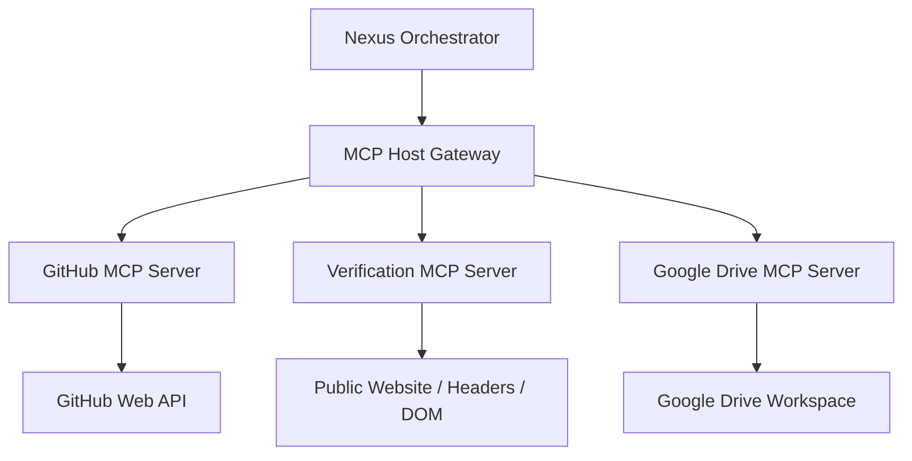

# SwarmOps MCP Tool Server Integration Guidelines

This document outlines the architectural patterns and interface contracts for extending SwarmOps using Model Context Protocol (MCP) tool servers. Future phases will introduce specialized MCP servers for:
1. **GitHub MCP Server**: Managing issues, committing changes, and opening pull requests.
2. **Verification MCP Server**: Performing live integration and deployment checks (e.g. status codes, sitemap pinging, DOM validation).
3. **Google Drive MCP Server**: Storing and sharing campaign briefs and reports.

---

## 🛠️ 1. Architecture Overview

SwarmOps interacts with MCP servers using a unified host gateway in the backend. Background agents do not communicate with MCP servers directly; instead, they declare tool usage intent, and the **Nexus Orchestrator** resolves tool execution through the MCP Gateway.



---

## 🔌 2. Unified MCP Host Gateway Interface

The backend should provide an abstract gateway class to initialize, discover, and execute tools exposed by any JSON-RPC based MCP server.

### Proposed Interface Class (`backend/core/mcp_gateway.py`)

```python
import os
import json
import logging
from typing import Dict, Any, List

logger = logging.getLogger(__name__)

class MCPHostGateway:
    def __init__(self, server_name: str, transport_command: List[str]):
        """
        Initialize an MCP Host Client.
        :param server_name: Identifier for the server (e.g., 'github', 'verification')
        :param transport_command: Command to spawn the tool server (e.g., ['node', 'dist/index.js'])
        """
        self.server_name = server_name
        self.transport_command = transport_command
        self.available_tools = []
        self._connected = False

    async def connect(self):
        """Establish stdin/stdout pipes with the sub-process MCP server."""
        logger.info(f"Connecting to MCP server '{self.server_name}' using: {self.transport_command}")
        # Initialization JSON-RPC handshake goes here...
        self._connected = True

    async def list_tools(self) -> List[Dict[str, Any]]:
        """List all tools exposed by this MCP server."""
        if not self._connected:
            await self.connect()
        # JSON-RPC method: 'tools/list'
        return self.available_tools

    async def call_tool(self, tool_name: str, arguments: Dict[str, Any]) -> Dict[str, Any]:
        """
        Execute a tool on the MCP server.
        :param tool_name: Name of the tool to execute
        :param arguments: Tool parameters
        """
        if not self._connected:
            await self.connect()
        logger.info(f"Calling MCP tool '{self.server_name}/{tool_name}' with arguments: {arguments}")
        # JSON-RPC method: 'tools/call'
        # Return structured tool result
        return {"content": [{"type": "text", "text": "Success"}]}
```

---

## 📂 3. Specifying MCP Tool Contracts

### A. GitHub MCP Server (`mcp-github`)
- **Purpose**: Let agents collaborate directly with developers on source code and deployment tasks.
- **Key Tools**:
  - `create_issue(repo: str, title: str, body: str)`: Creates issues for technical tasks.
  - `create_pull_request(repo: str, title: str, head: str, base: str, body: str)`: Submits automated fixes (e.g., adding `robots.txt`).
  - `write_file(repo: str, path: str, content: str, commit_message: str)`: Saves static files to the repository.

### B. Verification MCP Server (`mcp-verification`)
- **Purpose**: Verify that fixes (like robots.txt or sitemaps) are live and correctly configured without leaving the dashboard.
- **Key Tools**:
  - `verify_url_status(url: str)`: Pings the URL and returns the HTTP status code (expects 200).
  - `parse_robots_txt(url: str)`: Validates formatting and checks for sitemap declarations.
  - `check_dom_element(url: str, selector: str)`: Confirms existence of DOM elements (e.g., verifying `<h1>` exists).

### C. Google Drive MCP Server (`mcp-gdrive`)
- **Purpose**: Archive campaign reports, SEO audits, and content briefs into the user's shared folders.
- **Key Tools**:
  - `upload_document(folder_id: str, title: str, content: str, mime_type: str)`: Creates a Google Doc with Markdown-rendered briefs.
  - `share_file(file_id: str, emails: List[str], role: str)`: Automates boardroom document sharing with stakeholders.

---

## 🔐 4. Credential Management & Security

1. **Token Encrypted Storage**: All API keys, Access Tokens (GitHub OAuth, Google Workspace OAuth), and endpoints must be stored encrypted in the `user_credentials` table.
2. **Access Restrictions**: Before calling `call_tool`, the gateway must verify that the `project_id` and `user_id` match the credential owner.
3. **Execution Sandbox**: To prevent prompt injection attacks, arguments passed to MCP tools must be validated against JSON-schema definitions before sub-process spawning.
